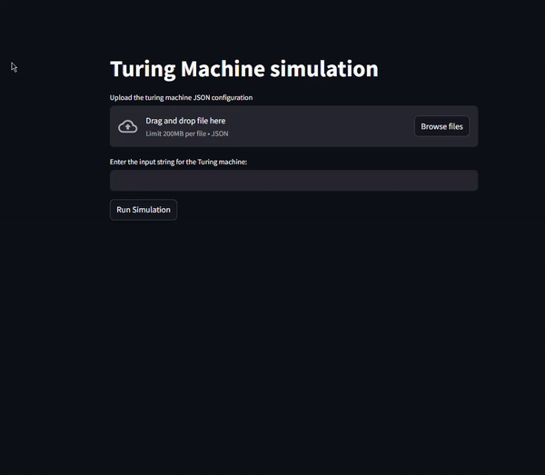

# Turing Machine Simulator

## Overview
This project provides a simulation of a Turing machine, allowing users to load Turing machine configurations from JSON files, input strings for the machine to process, and visualize the state transitions dynamically. The simulation can be used for educational purposes, demonstrations, or research.

## Features
- Load Turing machine configurations in JSON format.
- Enter input strings and simulate Turing machine operations.
- Visualize machine state transitions in real-time.
- Supports accept, reject, and loop states.
- Interactive user interface with Streamlit.

## Requirements

- Python 3.7 or higher
- Streamlit
- streamlit-agraph
- Graphviz (for rendering graphs)

To install Graphviz, visit Graphviz Download Page and add it to your system’s PATH.

### Installing Requirements

```bash
pip install -r requirements.txt
```

## Setup

1. Clone this repo:

```bash
git clone https://github.com/josuemj/Turing-Machine-Simulation
cd Turing-Machine-Simulation
```

2. Install dependencies:

```bash
pip install -r requeriments.txt
```

3. Run the Streamlit application:

```bash
streamlit run main.py
```

## Usage

1. Upload Configuration: Use the file uploader in the Streamlit app to upload a Turing machine configuration in JSON format. Ensure the format matches the expected structure.
2.  Enter Input String: In the input field, provide a string for the Turing machine to process.
3. Run Simulation: Click the "Run Simulation" button to see if the input string is accepted or rejected, and view the trace of configurations.
4. View Graph: The machine's states and transitions are visualized as a graph for better understanding.

# Sample Configuration JSON

```json
{
  "Q": ["q0", "q1", "q_loop", "q_accept", "q_reject"],
  "Sigma": ["1"],
  "Gamma": ["1", "0", "B"],
  "delta": {
    "q0": {
      "0": ["q_reject", "0", "S"],
      "1": ["q1", "1", "R"],
      "B": ["q_loop", "B", "S"]
    },
    "q1": {
      "0": ["q_reject", "0", "S"],
      "1": ["q1", "1", "R"],
      "B": ["q_accept", "B", "S"]
    },
    "q_loop": {
      "B": ["q_loop", "B", "S"]
    },
    "q_reject": {
      "0": ["q_reject", "0", "S"],
      "1": ["q_reject", "1", "S"],
      "B": ["q_reject", "B", "S"]
    },
    "q_accept": {
      "B": ["q_accept", "B", "S"]
    }
  },
  "q0": "q0",
  "q_accept": "q_accept",
  "q_reject": "q_reject"
}

```

# Demo


